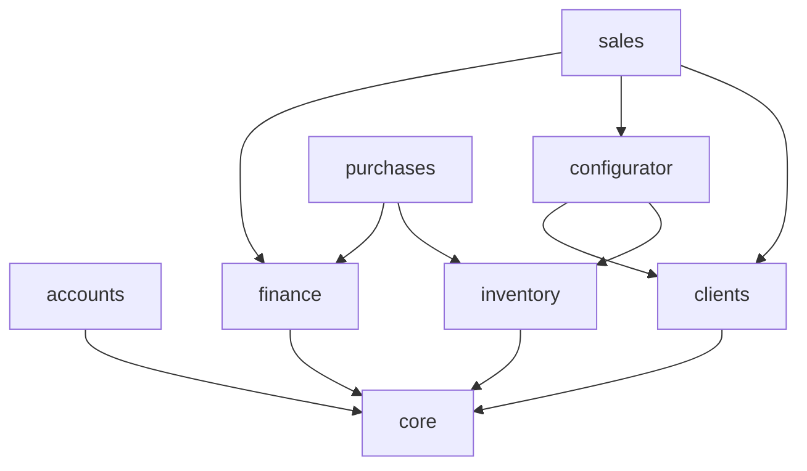

# 01 — Arxitektura

## Umumiy ko'rinish

```
React (keyingi bosqich)
        │  REST + JWT
        ▼
┌──────────────────────────────────────────────────┐
│  root/urls.py  →  include('apps.urls')           │
│  apps/urls.py  →  har bir app/urls.py ni yig'adi │
└──────────────────────────────────────────────────┘
        │
        ▼
   views.py  ──►  serializers.py  ──►  models/
        │
        └──────►  services.py   (biznes logika)
        │
        └──────►  permissions.py (rol tekshiruvi)
        │
        └──────►  core/mixins.py (ActivityLog + created_by)
```

## Qatlamlar

| Qatlam | Fayl | Vazifasi |
|---|---|---|
| Model | `apps/<app>/models/<model>.py` | Maydonlar, `TextChoices`, hisob-kitob `@property` lari |
| Serializer | `apps/<app>/serializers.py` | Validatsiya, nested qatorlar, `..._display` maydonlari |
| Service | `apps/<app>/services.py` | Ko'p bosqichli biznes logika (`@atomic`) |
| View | `apps/<app>/views.py` | `BaseModelViewSet` + `@action` endpointlar |
| Permission | `apps/accounts/permissions.py` | Rol asosidagi ruxsatlar |
| Marshrut | `apps/<app>/urls.py` | Har bir ilova o'z endpointlarini belgilaydi |
| Marshrut yig'uvchi | `apps/urls.py` | Barcha ilovalarning `urlpatterns` ini ketma-ket ulaydi |
| Metod xaritalari | `apps/core/routing.py` | `LIST`, `DETAIL`, `READ_LIST`, `READ_DETAIL` |

**Qoida:** ko'p bosqichli logika (ombor + kassa + status) hech qachon view ichida yozilmaydi — u `services.py` ga chiqariladi.

## Marshrutlar qanday yig'iladi

```
root/urls.py
  └── path('api/', include('apps.urls'))
        └── apps/urls.py
              ├── apps/accounts/urls.py    → users/ + auth/login/ + auth/refresh/
              ├── apps/clients/urls.py     → clients/
              ├── apps/inventory/urls.py   → warehouses/ products/ stocks/ ... (faqat GET)
              ├── apps/configurator/urls.py→ acts/ configurations/ ...
              ├── apps/purchases/urls.py   → purchases/ purchase-items/
              ├── apps/sales/urls.py       → leads/ contracts/ ...
              ├── apps/finance/urls.py     → cash-categories/ loans/ ...
              └── apps/core/urls.py        → dashboard/ activity-logs/ notifications/
```

**Router ishlatilmaydi.** Har bir manzil `path()` bilan aniq yoziladi — qaysi URL qaysi metodga
ulanishi ko'rinib turadi, ortiqcha avtomatik marshrutlar (format-suffix, api-root, ishlatilmaydigan
metodlar) yaratilmaydi:

```python
from apps.core.routing import DETAIL, LIST

urlpatterns = [
    path('products/', ProductViewSet.as_view(LIST), name='product-list'),
    path('products/<int:pk>/', ProductViewSet.as_view(DETAIL), name='product-detail'),
]
```

`apps/core/routing.py` da faqat takrorlanuvchi metod xaritalari turadi:

| Nom | Qiymati |
|---|---|
| `LIST` | `{'get': 'list', 'post': 'create'}` |
| `DETAIL` | `{'get': 'retrieve', 'put': 'update', 'patch': 'partial_update', 'delete': 'destroy'}` |
| `READ_LIST` / `READ_DETAIL` | faqat `get` |

Maxsus amallar ham shu tarzda, o'z manzili bilan:

```python
path('contracts/<int:pk>/confirm-payment/', ContractViewSet.as_view({
    'post': 'confirm_payment',
}), name='contract-confirm-payment'),
```

**Yangi app qo'shganda:** `apps/<app>/urls.py` yaratiladi va `apps/urls.py` ga bitta
`path('', include('apps.<app>.urls'))` qatori qo'shiladi. `root/urls.py` ga tegilmaydi.

## Ilovalar

### `apps/core` — asos
- `TimeStampedModel` — `created_at`, `updated_at` (barcha modellar shundan meros oladi)
- `ActivityLog` — kim, qachon, nima qilgani
- `Notification` — muddat eslatmalari
- `choices.py` — `Currency` (UZS/USD/EUR/CNY), `Direction` (in/out)
- `utils.py` — `deadline_progress()`, `deadline_color()`, `next_number()`
- `mixins.py` — `BaseModelViewSet` (audit + `created_by`)
- `views.py` — `DashboardView`, `ActivityLogViewSet`, `NotificationViewSet`
- `management/commands/check_deadlines.py`

### `apps/accounts` — foydalanuvchi va ruxsat
`User(AbstractUser)` + `role` (`admin` / `bugalter` / `sales`), `phone`, `language`.
`permissions.py`: `IsAdmin`, `IsAdminOrBugalter`, `IsAdminOrSales`, `CanManageClients`.

### `apps/clients` — mijozlar
Bitta `Client` modeli, ikki tur: `individual` va `legal`. Turga qarab majburiy maydonlar farq qiladi
(serializer + model `clean()` da tekshiriladi).

### `apps/inventory` — ombor
`Warehouse`, `Product` (`machine` / `component` / `other`), `ProductSpec` (bazaviy model tarkibi),
`Stock`, `StockMovement`.
`services.py`: `apply_movement()`, `sync_stock()`, `available_quantity()` — qoldiq faqat shu yerda o'zgaradi;
`create_product_from_order()` — buyurtma qilinganda yangi mahsulotni katalogga qo'shadi (TZ 7).
API tomonda bu ilova **faqat o'qish** uchun.

### `apps/configurator` — konfigurator
`Act` (faqat admin kiritadi), `Configuration`, `ConfigurationItem`.
`services.py`: `build_configuration_workbook()` — openpyxl bilan Excel chernovik.

### `apps/purchases` — Kirim
`Purchase` (`local` / `import` / `ustav`) va `PurchaseItem`.
`services.py`: `receive_purchase()` — ombor kirimi + kassa chiqimi bitta tranzaksiyada.

### `apps/sales` — Sotuv
`Lead` (og'zaki kelishuv), `Contract`, `ContractItem`, `ContractApproval`, `ContractPayment`.
`services.py`: `submit_contract()`, `approve_contract()`, `reject_contract()`, `confirm_payment()`.

### `apps/finance` — Kassa
`CashCategory` (yacheykalar), `CashTransaction`, `Loan`, `ExpenseRequest`.
`services.py`: `ensure_default_categories()`, `get_category()`, `record_transaction()`.

## Ilovalar bog'liqligi



- `finance` boshqa ilovalarga faqat **satrli FK** orqali bog'lanadi (`'sales.Contract'`, `'purchases.Purchase'`) — sikl yo'q.
- `sales.services` va `purchases.services` `finance.services.record_transaction()` ni chaqiradi.

## Sozlamalar — `root/settings/` paketi

Sozlamalar bitta katta fayl emas, mavzular bo'yicha bo'lingan:

```
root/settings/
    __init__.py     # hamma bo'lakni yig'adi (from ... import *)
    base.py         # BASE_DIR, SECRET_KEY, DEBUG, ilovalar, middleware, shablon, til, static/media
    database.py     # DATABASES
    auth.py         # AUTH_USER_MODEL, AUTH_PASSWORD_VALIDATORS
    rest.py         # REST_FRAMEWORK
    jwt.py          # SIMPLE_JWT — token muddatlari, rotatsiya, Bearer sarlavhasi
    spectacular.py  # SPECTACULAR_SETTINGS (OpenAPI)
    cors.py         # CORS_ALLOWED_ORIGINS (React dev server)
    business.py     # TZ raqamlari: 30%/15% chegarasi, qizil zona kunlari
```

`DJANGO_SETTINGS_MODULE` o'zgarmagan — `root.settings`.
Yangi bo'lak qo'shilsa, fayl yaratiladi va `__init__.py` ga bitta `import *` qatori qo'shiladi.

| Sozlama | Qiymat | Fayl |
|---|---|---|
| `AUTH_USER_MODEL` | `accounts.User` | `auth.py` |
| `DEFAULT_AUTHENTICATION_CLASSES` | JWT (simplejwt) | `rest.py` |
| `DEFAULT_PERMISSION_CLASSES` | `IsAuthenticated` | `rest.py` |
| `PAGE_SIZE` | 20 | `rest.py` |
| `ACCESS_TOKEN_LIFETIME` | 12 soat | `jwt.py` |
| `REFRESH_TOKEN_LIFETIME` | 7 kun | `jwt.py` |
| `ROTATE_REFRESH_TOKENS` | `True` | `jwt.py` |
| `AUTH_HEADER_TYPES` | `('Bearer',)` | `jwt.py` |
| `LANGUAGE_CODE` / `TIME_ZONE` | `uz` / `Asia/Tashkent` | `base.py` |
| `CORS_ALLOWED_ORIGINS` | `http://localhost:5173`, `http://127.0.0.1:5173` | `cors.py` |
| `PREPAYMENT_THRESHOLD` | `1_000_000_000` | `business.py` |
| `PREPAYMENT_PERCENT_SMALL` / `LARGE` | `30` / `15` | `business.py` |
| `DEADLINE_RED_ZONE_DAYS` | `10` | `business.py` |
