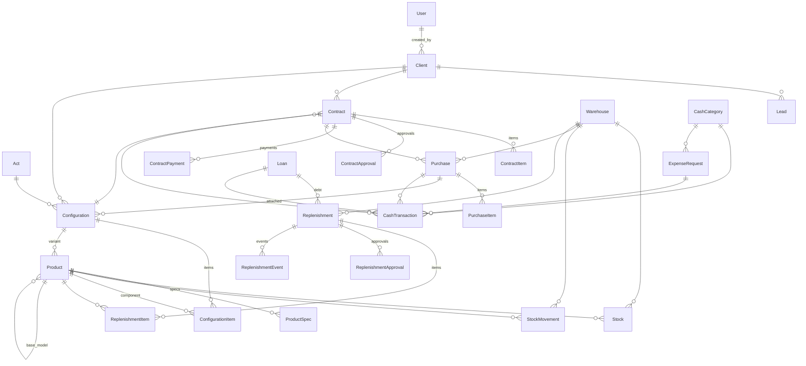

# 04 — Ma'lumotlar modeli

Barcha modellar (`User` dan tashqari) `apps.core.models.TimeStampedModel` dan meros oladi:
`created_at`, `updated_at`, default `ordering = ['-created_at']`.

## ER diagramma

---

## core

### `TimeStampedModel` (abstract)
| Maydon | Tur |
|---|---|
| `created_at` | DateTime (auto_now_add) |
| `updated_at` | DateTime (auto_now) |

### `ActivityLog`
| Maydon | Tur | Izoh |
|---|---|---|
| `user` | FK `accounts.User` (SET_NULL) | kim qildi |
| `action` | `create` / `update` / `delete` / `approve` / `reject` | |
| `entity` | Char(100) | model nomi |
| `object_id` | Char(50) | |
| `description` | Text | |
| `created_at` | DateTime | |

### `Notification`
| Maydon | Tur |
|---|---|
| `user` | FK `accounts.User` (SET_NULL, null = hamma uchun) |
| `title`, `message` | Char(200), Text |
| `level` | `info` / `warning` / `danger` |
| `entity`, `object_id` | manba obyekt |
| `due_date` | Date |
| `is_read` | Bool |

---

## accounts

### `User(AbstractUser)`
| Maydon | Tur | Izoh |
|---|---|---|
| `role` | `admin` / `bugalter` / `sales` / `buyurtmachi` | default `sales` |
| `phone` | Char(20) | |
| `language` | `uz` / `ru` / `en` | default `uz` |

Property: `is_admin`, `is_bugalter`, `is_sales`, `is_supplier`.

---

## clients

### `Client`
| Maydon | Tur | Majburiy |
|---|---|---|
| `type` | `individual` / `legal` | ha |
| `full_name` | Char(200) | jismoniy uchun |
| `passport` | Char(20), **unique** | jismoniy uchun |
| `company_name` | Char(200), **unique** | yuridik uchun |
| `inn` | Char(20), **unique** | yuridik uchun |
| `mfo` | Char(20) | yuridik uchun |
| `bank_name` | Char(200) | yuridik uchun |
| `account_number` | Char(30), **unique** | yuridik uchun |
| `director_name` | Char(200) | yuridik uchun |
| `jshshir` | Char(20), **unique** | ikkalasi uchun |
| `phone` | Char(20), **unique** | ha |
| `email` | Email | yo'q |
| `address` | Text | yo'q (TZ 2.1 da ixtiyoriy) |
| `note` | Text | yo'q |
| `created_by` | FK `accounts.User` | avtomatik |

Property: `display_name` (yuridik → `company_name`, jismoniy → `full_name`).

---

## inventory

> **Katalog ma'lumotnoma.** TZ da alohida "mahsulot qo'shish" bo'limi yo'q:
> yangi mahsulot Buyurtmachi to'ldirish buyurtmasiga qator qo'shganda paydo bo'ladi
> (TZ 7), qoldiq esa faqat Kirim va Chiqim orqali o'zgaradi (TZ 1).
> API tomonda bu modellar **faqat o'qish** uchun.

### `Warehouse`
`name`, `address`, `is_active`

### `Product`
| Maydon | Tur |
|---|---|
| `sku` | Char(50), unique |
| `name` | Char(200) |
| `kind` | `machine` / `component` / `other` |
| `description` | Text |
| `cost_price`, `sale_price` | Decimal(18,2) |
| `reorder_level` | PositiveInteger — TZ 7.1 to'ldirish chegarasi |
| `is_active` | Bool |
| `base_model` | FK `inventory.Product` (SET_NULL) — variant uchun bazaviy model |
| `signature` | Char(64), unique — konfiguratsiya tarkibi imzosi |

Property: `total_stock`, `is_low_stock`, `stock_price` (sotuv narxi, bo'lmasa tannarx), `is_variant`.

### `ProductSpec` — bazaviy model tarkibi
`product` (FK Product, CASCADE, `specs`), `component` (FK Product, PROTECT, `spec_usages`), `label`, `quantity`.
Unique: (`product`, `component`).

### `Stock`
`product`, `warehouse`, `quantity` (Decimal 18,2). Unique: (`product`, `warehouse`).

### `StockMovement`
| Maydon | Tur |
|---|---|
| `product`, `warehouse` | FK (PROTECT) |
| `type` | `in` / `out` / `adjust` |
| `reason` | `purchase` / `sale` / `configuration` / `manual` |
| `quantity` | Decimal(18,2) |
| `reference`, `note` | Char |
| `created_by` | FK User |

> `adjust` — `quantity` yakuniy qoldiqni bildiradi.

---

## configurator

### `Act`
`number` (unique), `title`, `description`, `issued_at`, `file`, `is_active`, `created_by`.

### `Configuration`
| Maydon | Tur |
|---|---|
| `number` | `CFG-00001` (avtomatik) |
| `client` | FK `clients.Client` (PROTECT, null) |
| `base_product` | FK `inventory.Product` (PROTECT) |
| `warehouse` | FK `inventory.Warehouse` (PROTECT, null) |
| `act` | FK `configurator.Act` (PROTECT, null) |
| `purchase` | FK `purchases.Purchase` (SET_NULL, null) |
| `variant` | FK `inventory.Product` (SET_NULL) — tayyor pozitsiya |
| `status` | `draft` / `ready` / `attached` / `cancelled` |
| `note`, `created_by` | |

Property: `items_total`, `total_price`, `signature`, `matching_variant`,
`missing_items`, `items_without_price`.

### `ConfigurationItem`
`configuration` (CASCADE, `items`), `component` (FK Product, PROTECT), `label`, `quantity`, `unit_price`.
`unit_price` bo'sh saqlansa — ombordagi narx avtomatik qo'yiladi.
Property: `subtotal`, `stock_price`, `needs_price`, `available`, `shortage`, `source` (`stock` / `purchase`).

---

## purchases

### `Purchase`
| Maydon | Tur |
|---|---|
| `number` | `KIR-00001` (avtomatik) |
| `type` | `local` / `import` / `ustav` |
| `status` | `draft` / `ordered` / `in_transit` / `received` / `cancelled` |
| `supplier` | Char(200) |
| `warehouse` | FK Warehouse (PROTECT) |
| `contract` | FK `sales.Contract` (SET_NULL, null) |
| `currency`, `exchange_rate` | `UZS/USD/EUR/CNY`, Decimal(18,4) |
| `lead_days` | PositiveInteger (masalan 90) |
| `ordered_at`, `expected_at`, `received_at` | Date |
| `customs_duty`, `tax_amount` | Decimal(18,2) — USTAF/import |
| `invoice_number`, `note`, `created_by` | |

Property: `items_total`, `total_amount`, `progress`, `days_left`, `color`.

### `PurchaseItem`
`purchase` (CASCADE, `items`), `product` (PROTECT), `quantity`, `unit_price`, `note`. Property: `subtotal`.

---

## sales

### `Contract`
| Maydon | Tur |
|---|---|
| `number` | `SHT-00001` (avtomatik) |
| `client` | FK Client (PROTECT) |
| `configuration` | FK Configuration (SET_NULL, null) |
| `status` | `draft` / `pending_bugalter` / `pending_admin` / `approved` / `active` / `completed` / `rejected` / `cancelled` |
| `currency` | default `UZS` |
| `total_amount` | Decimal(18,2) |
| `prepayment_percent` | Decimal(5,2), bo'sh bo'lsa avtomatik 30/15 |
| `term_days` | PositiveInteger, default 90 |
| `signed_at` | Date |
| `start_date` | Date — pul tasdiqlangan kun, sanoq shundan boshlanadi |
| `note`, `created_by` | |

Property: `items_total`, `prepayment_amount`, `paid`, `balance`, `progress`, `days_left`, `color`.

### `ContractItem`
`contract` (CASCADE, `items`), `product` (PROTECT), `quantity`, `unit_price`. Property: `subtotal`.

### `ContractApproval`
`contract` (CASCADE, `approvals`), `step` (`bugalter` / `admin` / `payment`),
`decision` (`approved` / `rejected`), `comment`, `decided_by`.

### `ContractPayment`
`contract` (CASCADE, `payments`), `amount`, `method` (`cash`/`card`/`transfer`),
`paid_at`, `is_prepayment`, `created_by`, `approved_by`.

### `Lead`
`client` (PROTECT), `title`, `stage` (`new`/`negotiation`/`verbal`/`contract`/`lost`),
`expected_amount`, `next_contact_at`, `note`, `contract` (SET_NULL), `created_by`.

---

## procurement (Buyurtmachi moduli)

### `Replenishment` — omborni to'ldirish hisobi
| Maydon | Tur |
|---|---|
| `number` | `TLD-00001` (avtomatik) |
| `warehouse` | FK Warehouse (PROTECT) |
| `supplier` | Char(200) — ta'minotchi |
| `status` | `draft` / `pending_bugalter` / `pending_admin` / `approved` / `ordered` / `in_transit` / `customs` / `delivered` / `rejected` / `cancelled` |
| `currency` | default `UZS` |
| `logistics_cost`, `other_cost` | Decimal(18,2) — buyurtmachi kiritadi |
| `paid_amount` | Decimal(18,2) — kassadan to'langan qism |
| `debt` | FK `finance.Loan` (SET_NULL) — qarzga o'tgan qism |
| `expected_at`, `delivered_at` | Date |
| `note`, `created_by` | |

Property: `items_total`, `total_amount`, `cash_available`, `shortfall`,
`debt_progress`, `debt_days_left`, `debt_color`, `default_debt_deadline`.

Konstanta: `DEBT_TERM_DAYS = 60` (TZ 7.2 — mahsulot kelgandan keyin 2 oy).

### `ReplenishmentItem`
`replenishment` (CASCADE, `items`), `product` (PROTECT), `quantity`, `unit_price`,
`supplier`, `note`. Property: `subtotal`, `needs_price`.

### `ReplenishmentApproval`
`replenishment` (CASCADE, `approvals`), `step` (`bugalter` / `admin`),
`decision` (`approved` / `rejected`), `comment`, `decided_by`.

### `ReplenishmentEvent` — yetkazib berish bosqichlari
`replenishment` (CASCADE, `events`), `stage` (`ordered` / `shipped` / `customs` /
`cleared` / `arrived` / `note`), `comment`, `happened_at`, `created_by`.

---

## finance

### `CashCategory`
`code` (unique), `name`, `direction` (`in`/`out`), `is_system`, `is_active`.

### `CashTransaction`
| Maydon | Tur |
|---|---|
| `direction` | kategoriyadan avtomatik olinadi |
| `category` | FK CashCategory (PROTECT) |
| `amount` | Decimal(18,2) |
| `currency`, `exchange_rate` | |
| `occurred_at` | DateTime |
| `description` | Text |
| `contract`, `purchase`, `loan`, `expense_request` | FK (SET_NULL) — manba |
| `created_by`, `approved_by` | FK User |

Property: `amount_uzs` (= `amount * exchange_rate`).

### `Loan`
`lender_name`, `amount`, `currency`, `taken_at`, `deadline`, `status` (`active`/`closed`),
`source` (`personal` / `supplier`), `note`, `created_by`.
Property: `term_days`, `days_left`, `color`, `repaid`, `balance`.

### `ExpenseRequest`
`category` (PROTECT), `amount`, `currency`, `purpose`, `status` (`pending`/`approved`/`rejected`),
`comment`, `requested_by`, `decided_by`, `decided_at`.
