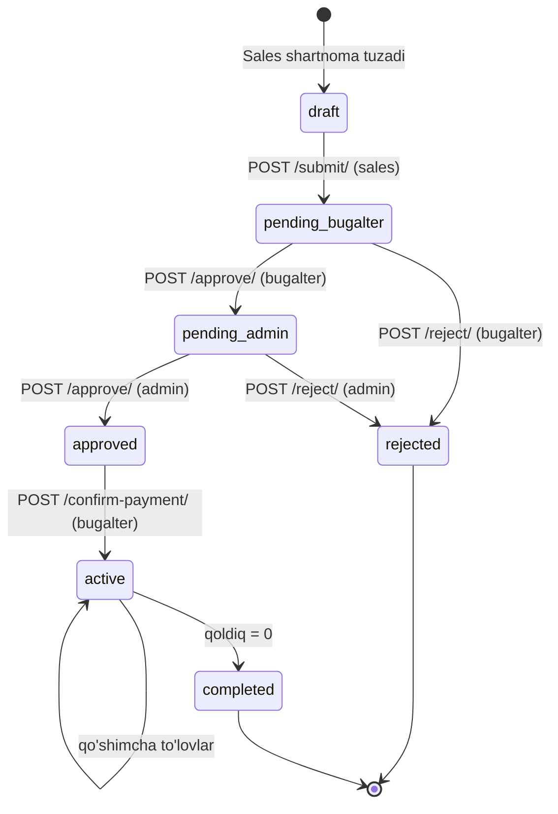
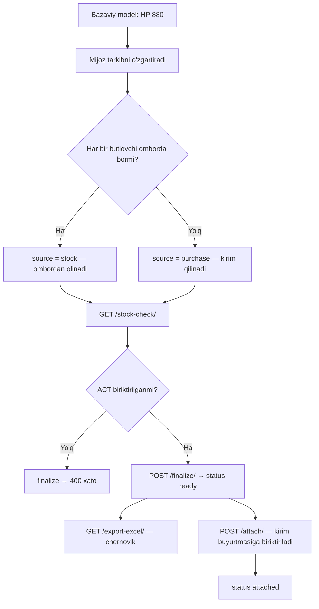
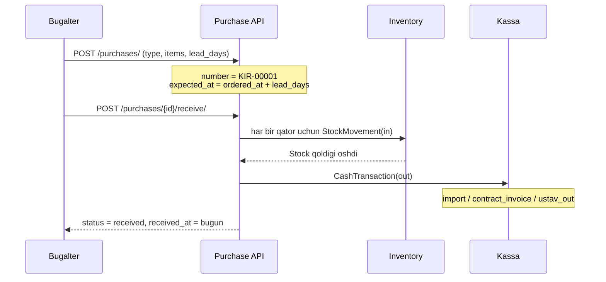
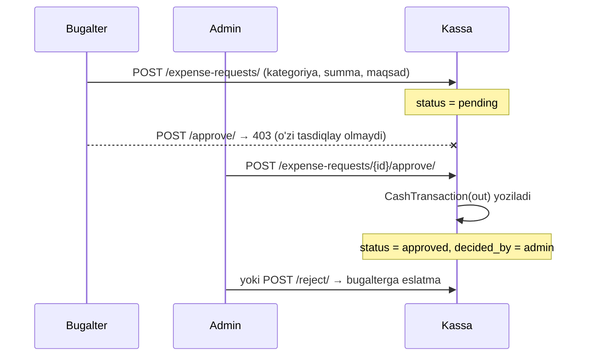
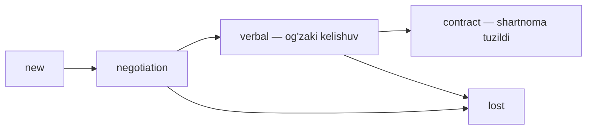

# 06 — Jarayonlar (workflow)

## 1. Shartnoma: sales → bugalter → admin → pul



Qadamlar:

1. **Sales** clientni tanlaydi (bo'lmasa `POST /clients/` bilan qo'shadi), kerak bo'lsa configurator qiladi,
   `POST /contracts/` bilan shartnoma tuzadi. Sotuv narxi shu bosqichda ko'rinadi.
2. `POST /contracts/{id}/submit/` — shartnoma bugalterga tushadi.
3. **Bugalter** bandlarni ko'rib `approve` qiladi → admin bosqichiga o'tadi.
4. **Admin** oxirgi etap sifatida `approve` qiladi → status `approved`, eslatma yaratiladi:
   *"Oldindan to'lov 30% — 150 000 000 UZS. Pul kutilmoqda."*
5. **Bugalter** pul kelganini `confirm-payment` bilan tasdiqlaydi:
   - `ContractPayment` yoziladi
   - kassaga `sale` kirimi tushadi
   - `start_date = bugun`, status `active` — **shu kundan kunlar sanog'i boshlanadi**
6. Qoldiq to'liq yopilsa status `completed`.

Har bir tasdiq/rad `ContractApproval` ga (kim, qachon, izoh) va `ActivityLog` ga yoziladi.

### Muddat ranglari

```
90 kunlik shartnoma:
kun 0 ────────────────► kun 63 ──────────► kun 80 ─────► kun 90
      🟢 yashil              🟡 sariq          🔴 qizil
                        (oxirgi 30%)      (oxirgi 10 kun)
```

`GET /contracts/{id}/timeline/` — `points[]` ichida har bir kun uchun rang tayyor holda keladi.

---

## 2. Configurator: mijoz tarkibni o'zgartiradi



- ACT ni **faqat admin** kiritadi (`POST /acts/`).
- Excel chernovik: butlovchi, belgi, miqdor, narx, summa, omborda, yetishmaydi, manba va jami.
- Configurator barcha rollarga ochiq.

---

## 3. Kirim (Purchase) qabul qilish



Ikkinchi marta `receive` qilinsa `400` qaytadi.

Import kunlari: `GET /purchases/{id}/timeline/` — shartnomadagi kabi rangli line chart.

---

## 4. Kassa: bugalterning xarajati admin ruxsati bilan



---

## 5. Kunlik eslatmalar

```bash
.venv/Scripts/python.exe manage.py check_deadlines
```

Nima qiladi:

| Manba | Shart | Eslatma darajasi |
|---|---|---|
| `Contract` (`active`) | rang `yellow` | `warning` |
| `Contract` (`active`) | rang `red` (oxirgi 10 kun yoki o'tib ketgan) | `danger` |
| `Loan` (`active`) | 10 kun va undan kam qolgan | `warning` / `danger` |
| `Purchase` (`ordered`, `in_transit`) | muddat yaqinlashgan | `warning` / `danger` |

Bir xil obyekt + muddat uchun o'qilmagan eslatma allaqachon bo'lsa, yangisi yaratilmaydi.

Windows Task Scheduler uchun kunlik komanda:

```bash
C:\Users\user\PycharmProjects\Warehouse_CRM_V2\.venv\Scripts\python.exe C:\Users\user\PycharmProjects\Warehouse_CRM_V2\manage.py check_deadlines
```

---

## 6. Og'zaki kelishuvdan shartnomagacha



`Lead.contract` maydoni orqali qaysi shartnomaga aylangani ko'rinadi;
`GET /api/dashboard/` da `leads_by_stage` bo'lib chiqadi.
