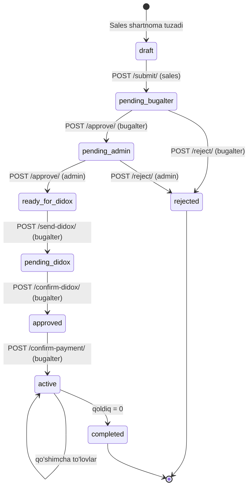
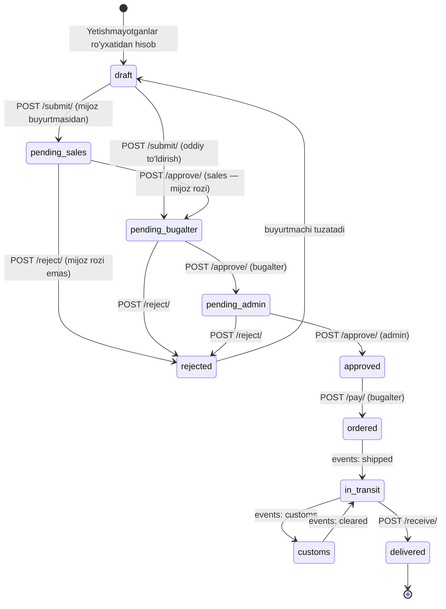
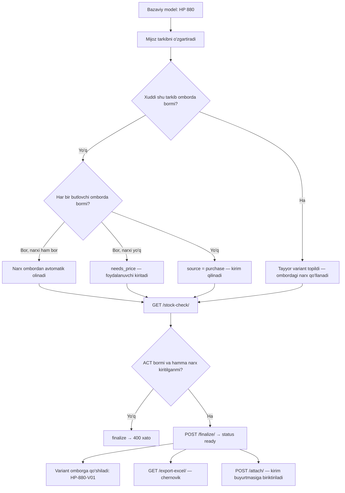
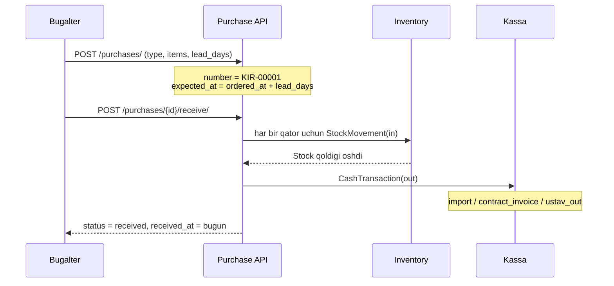
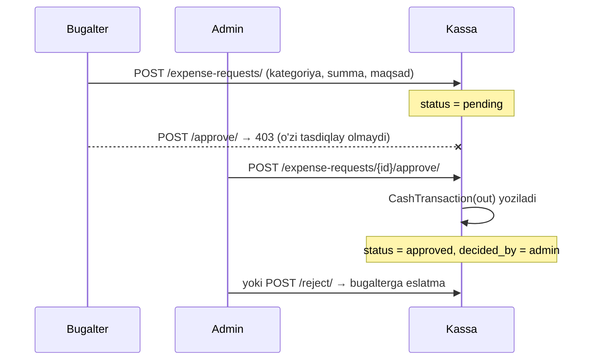
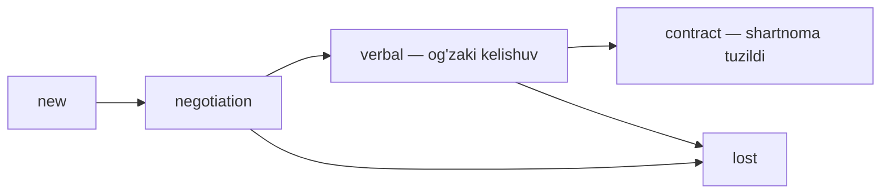

# 06 — Jarayonlar (workflow)

## 1. Shartnoma: sales → bugalter → admin → Didox → pul

> 12-§1: admin tasdig'i — RUXSAT, shuning uchun **Didoxdan oldin** so'raladi
> (hujjat hali qonuniy kuchga kirmagan bosqichda). Eski tartib (Didoxdan
> keyin admin) `12-CHANGELOG-TZ-2.1.md` §8.53 da qoldirilgan.



Qadamlar:

1. **Sales** clientni tanlaydi (bo'lmasa `POST /clients/` bilan qo'shadi), kerak bo'lsa configurator qiladi,
   `POST /contracts/` bilan shartnoma tuzadi. Sotuv narxi shu bosqichda ko'rinadi.
2. `POST /contracts/{id}/submit/` — shartnoma bugalterga tushadi.
3. **Bugalter** bandlarni ko'rib `approve` qiladi → chegaradan katta bo'lsa admin bosqichiga, kichik bo'lsa
   to'g'ridan-to'g'ri `ready_for_didox` ga o'tadi (tarixda avtomatik yozuv qoladi, §11.3).
4. **Admin** ruxsat sifatida `approve` qiladi → status `ready_for_didox` — endi Didoxga yuborilishi kerak.
5. **Bugalter** `POST /contracts/{id}/send-didox/` (`didox_number` majburiy) → `pending_didox`, mijoz imzosi
   kutilmoqda (orqaga yo'l yo'q — Didox rad etsa mijoz Didoxning o'zida qayta yuboradi).
6. **Bugalter** `POST /contracts/{id}/confirm-didox/` — mijoz imzoladi → status `approved`, eslatma yaratiladi:
   *"Oldindan to'lov 30% — 150 000 000 UZS. Pul kutilmoqda."*
7. **Bugalter** pul kelganini `confirm-payment` bilan tasdiqlaydi:
   - `ContractPayment` yoziladi
   - kassaga `sale` kirimi tushadi
   - `start_date = bugun`, status `active` — **shu kundan kunlar sanog'i boshlanadi**
   - **sotilgan mahsulotlar ombordan chiqim qilinadi** (yetmasa to'lov bloklanadi)
8. Qoldiq to'liq yopilsa status `completed`.

Har bir tasdiq/rad `ContractApproval` ga (kim, qachon, izoh) va `ActivityLog` ga yoziladi.

### Teskari o'tishda ikki narsa bo'lishi shart (12-§5)

> Ish orqaga qaytganda (rad etish, qaytarish, aniqlashtirish so'rash)
> **ikki narsa** bajarilishi shart:
>
> 1. **Eslatma** — endi ish kimda bo'lsa, o'shanga (`Notification`);
> 2. **Navbat** — o'sha odamning `my-work`/yon panel manbasida qator
>    paydo bo'lsin (`apps/core/services.py` — `collect_work` manbalari).
>
> Bittasi yetmaydi: eslatma o'qilgach yo'qoladi, navbat esa ish
> bajarilmaguncha turadi. Yangi teskari o'tish qo'shilganda shu savol
> berilsin: *"Bu o'tishdan keyin ish kimda? O'sha odamning yon panelida
> sanoq o'zgaradimi?"*

### Muddat ranglari

```
90 kunlik shartnoma (TZ 5.3):
qolgan kun:  90 ─────────────── 31 │ 30 ────────── 11 │ 10 ──────── 0
             🟢 yashil            │ 🟡 sariq        │ 🔴 qizil
                                  (oxirgi 1/3)       (oxirgi 10 kun)
```

`GET /contracts/{id}/timeline/` — `points[]` ichida har bir kun uchun rang tayyor holda keladi.

---

## 1.1 Omborni to'ldirish (Buyurtmachi) — TZ 7



Qadamlar:

1. **Buyurtmachi** `GET /replenishments/low-stock/` bilan yetishmayotganlarni ko'radi va
   `POST /replenishments/from-low-stock/` bilan hisob shakllantiradi
2. Har bir pozitsiyaga ta'minotchi narxini, so'ng `logistics_cost` va `other_cost` ni kiritadi
3. `POST /submit/` → mijoz buyurtmasidan (konfiguratsiyadan) ochilgan hisob avval
   **Sales**ga boradi — sales mijoz bilan kelishib `approve` qiladi (rozi bo'lmasa
   `reject`); oddiy to'ldirish to'g'ridan-to'g'ri **Bugalter**ga tushadi va bugalter
   tekshiradi (`approve`) yoki qaytaradi (`reject`)
4. **Admin** ko'rib chiqadi: miqdorni o'zgartiradi, pozitsiya o'chiradi, so'ng tasdiqlaydi.
   Oynada `total_amount` va `cash_available` yonma-yon turadi
5. **Bugalter** `POST /pay/` qiladi:
   - pul yetsa → to'liq kassadan chiqim
   - yetmasa → farqi (`shortfall`) **qarzga** o'tadi (`Loan.source = supplier`)
6. Yetkazib berish bosqichlari `POST /events/` bilan qayd etiladi (bojxona va h.k.)
7. `POST /receive/` → ombor qoldig'i oshadi, **qarz muddati shu kundan 60 kun** bo'lib qayta hisoblanadi

### Pul yetmagan holat (TZ 7.1 misoli)

```
Jami:          1 400 000
Kassada:         500 000
Yetmayapti:      900 000  →  Loan(source=supplier, deadline = kirim + 60 kun)
```

## 2. Configurator: mijoz tarkibni o'zgartiradi



Narxlash qoidalari (TZ 6.2):

| Holat | Tizim nima qiladi |
|---|---|
| Butlovchi omborda bor, narxi bor | Narx avtomatik olinadi (`unit_price` bo'sh yuborilsa) |
| Omborda bor, narxi yo'q | `needs_price: true` — narx kiritilmaguncha yakunlanmaydi |
| Omborda yo'q | `source: purchase` — kirim qilish kerakligi belgilanadi |
| Aynan shu tarkib avval yig'ilgan | Tayyor variant (`ready_variant`) va uning ombordagi narxi qo'llanadi |

Tarkib **imzo (signature)** bilan saqlanadi — komponentlar tartibi muhim emas,
bir xil kombinatsiya doim bir xil imzo beradi.

- ACT ni **sales** kiritadi (`POST /acts/`, admin ham mumkin) — engineer
  konfiguratsiyani ACT'siz tayyorlab beradi, sales ACT bilan yakunlaydi.
- Excel chernovik: butlovchi, belgi, miqdor, narx, summa, omborda, yetishmaydi, manba va jami.
- Configurator barcha rollarga ochiq.

---

## 3. Kirim (Purchase) qabul qilish



Ikkinchi marta `receive` qilinsa `400` qaytadi.

Import kunlari: `GET /purchases/{id}/timeline/` — shartnomadagi kabi rangli line chart.

---

## 4. Kassa: bugalterning xarajati admin ruxsati bilan



---

## 5. Kunlik eslatmalar

```bash
.venv/Scripts/python.exe manage.py check_deadlines
```

Nima qiladi:

| Manba | Shart | Eslatma darajasi |
|---|---|---|
| `Contract` (`active`) | rang `yellow` | `warning` |
| `Contract` (`active`) | rang `red` (oxirgi 10 kun yoki o'tib ketgan) | `danger` |
| `Loan` (`active`) | 10 kun va undan kam qolgan | `warning` / `danger` |
| `Purchase` (`ordered`, `in_transit`) | muddat yaqinlashgan | `warning` / `danger` |

Bir xil obyekt + muddat uchun o'qilmagan eslatma allaqachon bo'lsa, yangisi yaratilmaydi.

Windows Task Scheduler uchun kunlik komanda:

```bash
C:\Users\user\PycharmProjects\Warehouse_CRM_V2\.venv\Scripts\python.exe C:\Users\user\PycharmProjects\Warehouse_CRM_V2\manage.py check_deadlines
```

---

## 6. Og'zaki kelishuvdan shartnomagacha



`Lead.contract` maydoni orqali qaysi shartnomaga aylangani ko'rinadi;
`GET /api/dashboard/` da `leads_by_stage` bo'lib chiqadi.

---

## 7. Yo'l xaritasi ↔ navbat audit (19-§3)

Qoida (12-§5): *ish kimdadir bo'lsa, ikki narsa bo'lishi shart — eslatma
**va** navbat*. Yo'l xaritasi (`apps/core/roadmap.py`, `STEPS`, 20 qadam)
va navbat (`apps/core/services.py`, `collect_work`) qo'lda sinxron
tutiladi — bu jadval har qadamning joriy rolini navbatdagi mos manba
bilan solishtiradi (20-to'plamdan keyingi holat, 2026-09-24).

| Qadam | Rol | Navbat manbai | Holat |
|---|---|---|---|
| `zvk_created` | sales | — (yaratish o'zi, kutish emas) | n/a |
| `taken` | engineer | `_request_source` (`new`/`in_progress`) | ✅ |
| `price_request` | buyurtmachi | `needs_price` (`?needs_price=true`, QOLGAN-ISHLAR-2 §6) | ✅ |
| `submitted` | engineer → sales kutadi | `_configuration_source` sales (`pending_sales`) | ✅ |
| `sales_review` | sales | `_configuration_source` sales | ✅ |
| `contract_created` | sales | — (avtomatik, `approve`da ochiladi) | n/a |
| `contract_submitted` | sales → bugalter kutadi | `_contract_sources` bugalter (`pending_bugalter`) | ✅ |
| `bugalter_check` | bugalter | `_contract_sources` bugalter | ✅ |
| `admin_approve` | admin | `_contract_sources` admin (`pending_admin`) | ✅ |
| `didox_sent` | bugalter | `_contract_sources` bugalter (`ready_for_didox`) | ✅ |
| `didox_confirmed` | bugalter | `_contract_sources` bugalter (`pending_didox`) | ✅ |
| `approved_waiting` | bugalter | `_contract_sources` bugalter (`approved`) | ✅ |
| `prepayment` | bugalter | (`approved_waiting` bilan bitta holat) | ✅ |
| `procurement_sent` | engineer | `_configuration_source` engineer | ❌ **bo'shliq** |
| `procurement_chain` | buyurtmachi | `_replenishment_source` buyurtmachi | ✅ |
| `assemble` | engineer | `_configuration_source` engineer (`assemble`) | ✅ |
| `finalize` | engineer | `_configuration_source` engineer (`finalize_ready`) | ✅ |
| `act_review` | bugalter | `_act_source` (20-§3.7, yangi) | ✅ |
| `ship` | sales | `_contract_sources` sales (`active`, yetkazilmagan) | ✅ |
| `completed` | sales | — (terminal holat) | n/a |

### Topilgan bo'shliq: `procurement_sent`

`_configuration_source` (engineer) faqat ikkita sabab beradi: `assemble`
(yig'ish) va `finalize_ready`. `approved` + to'langan konfiguratsiyada
**yetishmayotgan butlovchi bo'lsa ham** — engineerga navbatda "Yig'ish"
ko'rsatiladi, holbuki haqiqiy keyingi amal — **"Buyurtmachiga yuborish"**
(`request-procurement`). "Yig'ish" bosilsa 400 qaytadi (butlovchi
yo'qligi haqida) — zarar yo'q, lekin navbat noto'g'ri ko'rsatma beradi.

Bu alohida to'plam sifatida keyinroq tuzatiladi (`spawn_task` orqali
belgilangan): `engineer_row` ga `obj.missing_items` tekshiruvi qo'shilib,
sabab `procurement_sent`/`request_procurement`ga almashtirilsin.
